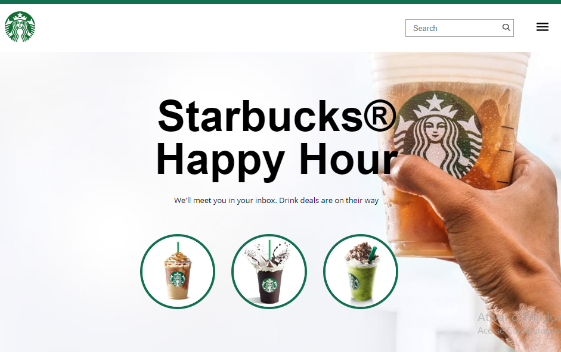
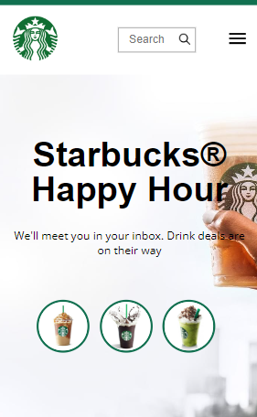

# ProStarbucks Page

Bem-vindo ao ProStarbucks, o meu primeiro projeto desenvolvido com HTML e CSS! Este projeto foi criado como parte do meu aprendizado inicial em desenvolvimento web, e tem como objetivo replicar a página inicial do Starbucks, uma das marcas mais conhecidas no mundo.

## Demonstração

Confira a versão ao vivo do projeto: [Starbucks Page](https://starbucks-landing-page.netlify.app/)

  
  

## Recursos do Projeto

- Página inicial responsiva, adaptável a diferentes dispositivos e tamanhos de tela.
- Utilização de HTML semântico para uma estrutura organizada e acessível.
- Estilização utilizando CSS para criar um layout visualmente atraente e harmonioso.
- Integração de imagens e ícones para enriquecer a experiência do usuário.
- Utilização de técnicas básicas de design e layout para criar uma página visualmente atraente.

Obrigado por visitar o meu primeiro projetinho! :)
